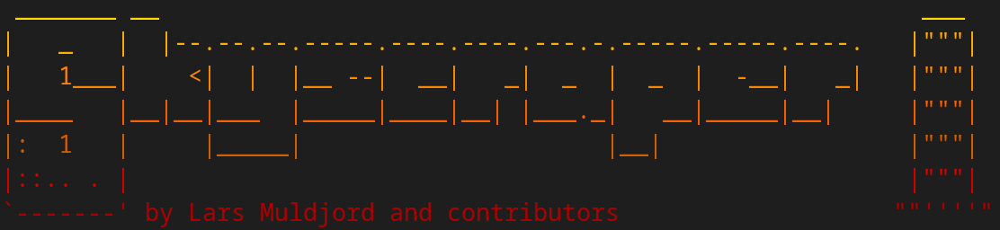

## Skyscraper Enhanced and Reloaded

Welcome to the powerful one-stop scraping-tool to maintain your gamelists!

<figure markdown>
  
</figure>

This fork is based on commit `654a31b` from 2022-10-26 from [Joe Huss'
Skyscraper fork](https://github.com/detain/skyscraper). Skyscraper focuses on
RetroPie integration but it can also be used without RetroPie. The
RetroPie-Setup has a scriptmodule to install this Skyscraper fork.

See also [changes](CHANGELOG.md) since Lars' retired his project.
